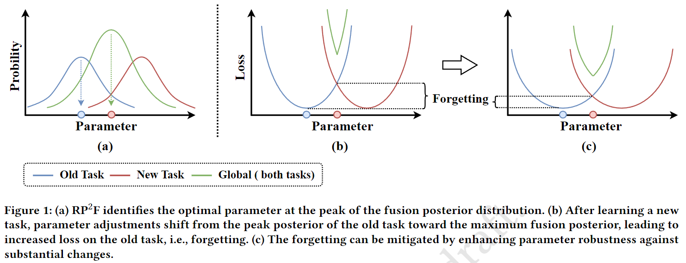

# Code for PR^2^F

> ACM Multimedia 2024
>
> Paper Title: Incremental Learning via Robust Parameter Posterior Fusion




## Setup

-   Use `./main.py` to run experiments.
-   Some training result can be found in folder `./result`.

## Datasets

**Class-IL / Task-IL settings**

-   Sequential CIFAR-100
-   Sequential Tiny ImageNet

## Requirement

+ numpy==1.16.4
+ Pillow==6.1.0
+ torch==1.3.1
+ torchvision==0.4.2

## Citation

```
@inproceedings{rp2f,
  title={Incremental Learning via Robust Parameter Posterior Fusion},
  author={Sun, Wenju and Li, Qingyong and Zhang, Siyu and Wang, Wen and Geng, YangLi-ao},
  booktitle={Proceedings of the 29th ACM International Conference on Multimedia},
  year={2024}
}
```
